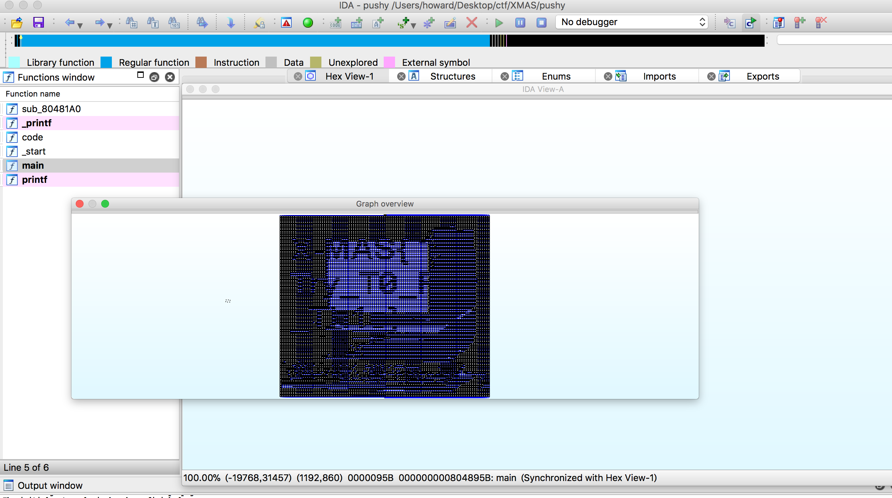

# Thank you Jiang Ying

> Author: howard41436 | 楊皓丞 | B06902097, devin6011 | 林首志 | B06902049

### Description

I found this really weird software on my computer... how can I reverse-engineer it?

### Solution

When I execute the code, a pusheen is shown on the screen. When I `objdump` it, it bumps out about 10000 functions, named `0_0~100_100`. After some researches I found a technique called [REpsych](https://github.com/xoreaxeaxeax/REpsych), that can generate a executable, and its control flow graph viewed in IDA looks like an image. It becomes reasonable that the executable contains 10000 2d-indexed functions. When viewed in IDA, it looked like this:

The flag is not very clear, but through zooming in and out the window, I can identify every separate charater and get the flag.